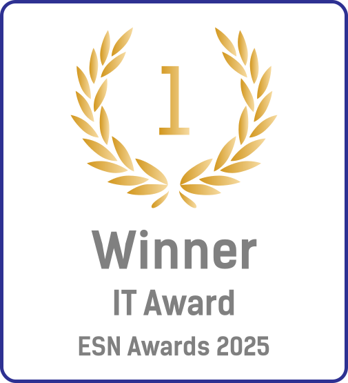

<h1 align="center">
     
    Polaris
</h1>

Polaris is a web-based application designed for interactive team games, primarily scavenger hunts.
Participants navigate between locations using text or image clues and complete location-specific challenges, with
progress tracked via unique team links activated by QR codes.
It features easy configuration of teams, locations, hints, and challenges using CSV files, an optional general task
checklist, and a built-in tool to generate QR codes for game setup.
This flexibility makes Polaris highly adaptable for various events and settings.

## Features

- **⏱️ Team-Based Gameplay:** Supports multiple teams competing simultaneously.
- **📍 Milestone Progression:** Guides teams through a sequence of locations (milestones).
- **📱 Responsive Design**: Basic styling provided for usability on mobile devices.
- **💭 Flexible Hints:** Provides hints via text and optionally images.
- **🎯 Location Challenges:** Includes optional text-based challenges for participants to complete at each milestone.
- **📋 Game Checklist:** Features an optional general checklist of tasks participants can complete anytime during the
  game.
- **✅ Game Validation:** Provides a validation screen at the end to check milestone completion.
- **📷 QR Code Integration:** Utilizes QR codes for easy check-in at locations and clue retrieval.
- **🍪 Progress Tracking**: Uses browser cookies to maintain team progress, allowing players to resume if they leave the
  game.
- **🖨️ Built-in QR Code Generator:** Includes a tool to generate a PDF of QR codes for all game locations based on a CSV
  file and base URL.
- **️✏️ Customizable Game Content**: Uses CSV files to manage game data, allowing easy modification without code
  changes.
- **🖼️ Customizable Branding:** Allows customization of the game logo and favicon.
- **⚠️ Game Override:** Includes an override feature for troubleshooting or manual adjustments.

## Setup and Configuration

Refer to the detailed [SETUP.md](./SETUP.md) file for comprehensive instructions on configuring game resources (hints,
challenges, checklist, locations using CSV files) and customizing images (logo, favicon).

**Key Setup Points:**

- **CSV Files:** Game data (hints, challenges, locations, checklist) is managed via CSV files stored in the
  `assets/game/` directory.
  * Files must use **semicolon (;) separators**.
  * Team names and milestone names must be consistent across files.
  * Use `NULL` for empty fields where applicable.
- **Images:** Place custom `logo.svg` and `favicon.svg` in the `assets/game/` folder. Default Polaris logos will be used
  if these are missing.
- **Project Structure:** Follow the recommended project structure outlined in `SETUP.md`.

## Installation & Running

Polaris is a static web application.

1. **Dependencies:** While primarily static, the QR code generation feature utilizes client-side JavaScript libraries.
   Ensure you have Node.js and npm installed if you intend to modify or build the project using Vite.

* Run `npm install` to install development dependencies if needed.

2. **Build (Optional):** If modifications were made, you can build the project using `npm run build` (assuming a
   relevant script exists in `package.json` based on the `vite.config.js` setup).
3. **Hosting:** Host the entire project folder on any static web server (like GitHub Pages, Netlify, Vercel, Amazon S3,
   or a standard Apache/Nginx server).

## Game Flow

1. **Access the Game:** Players navigate to the hosted `index.html` page.
2. **Enter Team Name:** Players enter their designated team name to begin.
3. **Receive First Clue:** Upon starting, the first clue (and challenge, if applicable) is displayed.
4. **Navigate & Scan:** Players solve the clue, go to the location, and find the corresponding QR code. Scanning the QR
   code directs them to the next step in the game.
5. **View Hints:** At each correct location page, players click "View Hint" to get the clue/challenge for the next
   milestone.
6. **Checklist:** Players can optionally track non-location-specific tasks using the checklist drawer.
7. **Finish & Validate:** Upon reaching the final milestone link, players click "Validate Result" to see their
   completion status.

## QR Code Generation

1. Access the generator via the "Generate QR Codes" link on the main game page.
2. Upload a **semicolon-separated** CSV file containing location names (rows for teams, columns for milestones, matching
   other game files).
3. Enter the **Base URL** where the `index.html` file is hosted (e.g., `https://yourdomain.com/polaris`) - **do not
   include a trailing slash**.
4. Click "Generate" to download a PDF containing QR codes for each location, labeled accordingly.

## Dependencies

- **Runtime**:
  - None (core game logic uses standard browser features).
- **UI**:
  - **[Google Fonts](https://fonts.google.com/icons):** Utilizes Material Symbols Rounded for icons.
- **QR Code Generation**:
  - **[qr-code-styling](https://www.npmjs.com/package/qr-code-styling):** Used for generating stylized QR codes (MIT
    License).
  - **[jsPDF](https://www.npmjs.com/package/jspdf):** Used for generating the QR code PDF document (MIT License).
- **Development**:
  - **[Vite](https://vitejs.dev/):** Used for building the project.

## Contributing

**Reporting Issues:**

* Use the GitHub Issues section to report bugs, suggest features, or ask questions.
* Please provide as much detail as possible, including steps to reproduce the issue, expected behavior, and actual
  behavior.
* Include relevant information like browser version, operating system, and any error messages.

**Submitting Pull Requests:**

1. **Fork the repository:** Create your own copy of the project.
2. **Create a branch:** Make a new branch in your fork for your changes (e.g.,
   `git checkout -b feature/your-feature-name` or `bugfix/issue-description`).
3. **Make your changes:** Implement your feature or bug fix. Ensure your code follows the existing style and
   conventions.
4. **Test your changes:** Make sure your changes don't introduce new issues and that the application still works
   correctly.
5. **Commit your changes:** Write clear and concise commit messages explaining the purpose of your changes.
6. **Push your changes:** Push your branch to your forked repository.
7. **Open a Pull Request:** Submit a pull request from your branch to the main Polaris repository's `main` branch.
   Provide a clear description of the changes you've made and why.

We appreciate your contributions to making Polaris better!

## License

This project is under the [Apache 2.0](./LICENSE) Licence.